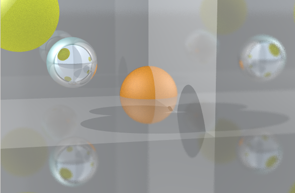
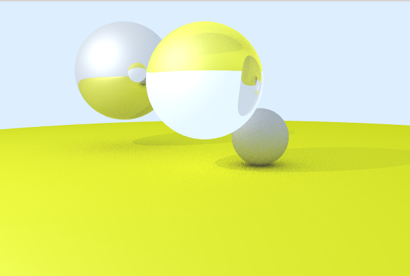
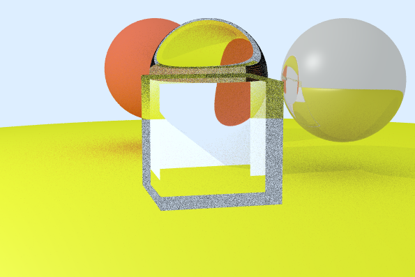
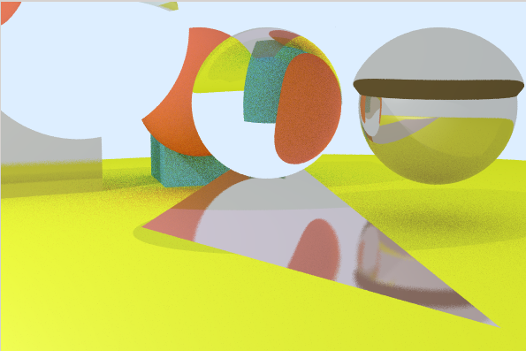

# Ray-Tracing Rendering System in OpenGL

OpenGL rendering system that builds a ray-tracing model that supports different object types (planes, cubes, spheres and triangle meshes), that can have multiple materials (Lambertian, Metal, Translucent, Isotropic). The presence of point lights is used to give light to the scenes.

| | | |
|-|-|-|
| **Programming language**  | Python 2 |
| **Language**   | English (variables and functions), Catalan (comments) |
| **Authors** | Albert Espín and Pau Sanchez (partially, since the base code was provided by Prof. Anna Puig) |
| **Date**  | Q1 2017  |

## Render Gallery

